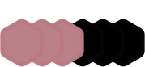
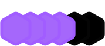

  
  

   

   

    

   
  
  👌 **Eu procuro constantemente atualizar meus projetos novos e antigos com conhecimentos mais novos.**   [_I constantly try to update my new and old projects with younger knowledge._]   
  📚 **Conhecimento em HTML, CSS, Javascript, Typescript, Java, ANSI C, C++ e Java de forma predominante.**   [_Knowledge in HTML, CSS, JavaScript, TypeScript, Java, ANSI C, C ++ and Java in a predominant way._]   
  🏕️ **Sempre em busca de inspiração em lugares da natureza e do dia a dia para encontrar novas ideias.**   [_Always looking for inspiration in different places to find new ideas._]   
  👷 **Sou favorável a críticas construtivas para o bem da minha evolução profissional e pessoal.**   [_I am in favor of constructive criticism for the good of my professional and personal evolution._]   
  🤝 **Considero interessante o trabalho cooperativo, com um objetivo em comum.**   [_I consider the cooperative work interesting, with a common goal._]

    
  
  

  

    
  
  
  
  
  
  

  

    

  

  ### Marking/Programming Languages
  
  
    
  
  
    
  
   

  ### Other tools
   
   
    
   
   
   

 
