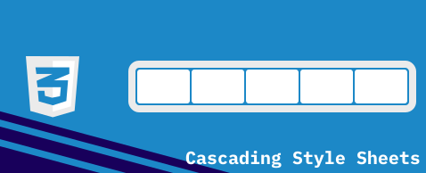
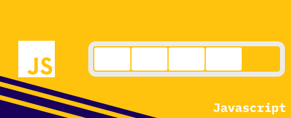
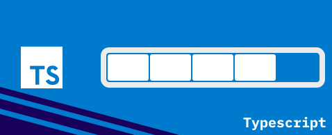
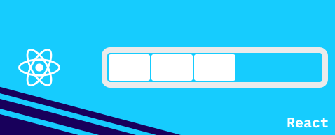
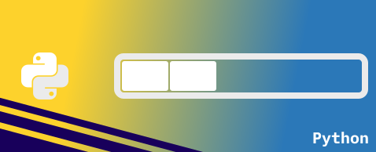
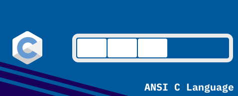
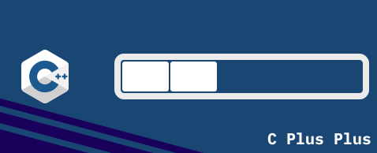

  
  

     

   

   

  

      

   
  
  👌 **Eu penso frequentemente sobre como pode se melhorar os códigos existentes.**   [_I think a lot about how to improve existing codes._]   
  📚 **Base principal de conhecimento em HTML, CSS, Javascript e Typescript.**   [_Main base knowledge in HTML, CSS, Javascript and Typescript._]   
  🏕️ **Sempre em busca de inspiração em lugares distintos para encontrar novas ideias.**   [_Always looking for inspiration in different places to find new ideas._]
  
      
  
  

  

    
   
   
   
   
  

  

      

  

  
  
  
  
  
  
  
  
  
  
  
  

 
